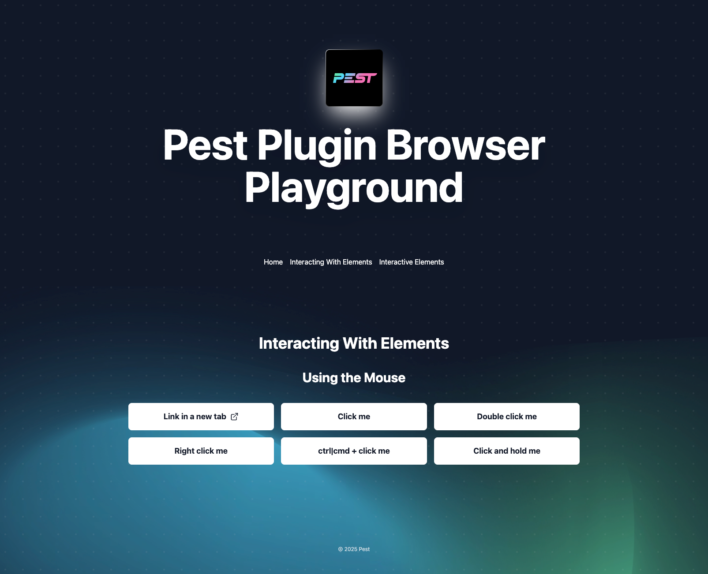

# Pest Plugin Browser

This repository contains the Pest Plugin Browser.

> If you want to start testing your application with Pest, visit the main **[Pest Repository](https://github.com/pestphp/pest)**.

## Community & Resources

-   Explore our docs at **[pestphp.com »](https://pestphp.com)**
-   Follow us on Twitter at **[@pestphp »](https://twitter.com/pestphp)**
-   Join us at **[discord.gg/kaHY6p54JH »](https://discord.gg/kaHY6p54JH)** or **[t.me/+kYH5G4d5MV83ODk0 »](https://t.me/+kYH5G4d5MV83ODk0)**
-   Follow the creator Nuno Maduro:
    -   YouTube: **[youtube.com/@nunomaduro](https://www.youtube.com/@nunomaduro)** — Videos every weekday
    -   Twitch: **[twitch.tv/enunomaduro](https://www.twitch.tv/enunomaduro)** — Streams (almost) every weekday
    -   Twitter / X: **[x.com/enunomaduro](https://x.com/enunomaduro)**
    -   LinkedIn: **[linkedin.com/in/nunomaduro](https://www.linkedin.com/in/nunomaduro)**
    -   Instagram: **[instagram.com/enunomaduro](https://www.instagram.com/enunomaduro)**
    -   Tiktok: **[tiktok.com/@enunomaduro](https://www.tiktok.com/@enunomaduro)**

## Installation (for development purposes)

1. Install PHP dependencies using Composer:

```bash
composer install
```

2. Install Node.js dependencies:

```bash
npm install
```

3. Install Playwright browsers:

```bash
npx playwright install
```

## Running Tests

To run the test suite, execute:

```bash
./vendor/bin/pest
```

## The Playground



For each Operation/Assertion, we add a corresponding Test.

We can make use of the `playground()->url()` helper, to get its URL during the test.

We can provide a URI that will be appended, e.g: `playground()->url('/test/interactive-elements')`.

```php
$this->visit(playground()->url('/test/interactive-elements'))
    ->assertUrlIs(playground()->url('/test/interactive-elements'))
```

### Routes and views for testing

Check the `playground/resources/views/test-pages` folder for existing views.

They are accessible by the playground route `/test/{page}`.

E.g.: The view `resources/views/test-pages/interactive-elements.blade.php` is visited
on `playground()->url('/test/interactive-elements')`.

The playground is standard Laravel App, where you may add a page with a feature for your test.

Just add the view, and the Nav Menu will automatically update based on the view name.

## License

Pest is an open-sourced software licensed under the **[MIT license](https://opensource.org/licenses/MIT)**.

# Documentation

Pest Plugin Browser brings end-to-end testing to the elegant syntax from Pest.
This allows to test your application in a browser environment, enabling to test all the components, such as frontend,
backend and database.

## Installation

TBD

## Available Operations

-   [url](#url)
-   [goto](#goto)
-   [title](#title)
-   [getAttribute](#getattribute)
-   [querySelector](#queryselector) / [querySelectorAll](#queryselectorall)
-   [locator](#locator)
-   [getByRole](#getbyrole)
-   [getByTestId](#getbytestid)
-   [getByAltText](#getbyalttext)
-   [getByLabel](#getbylabel)
-   [getByPlaceholder](#getbyplaceholder)
-   [getByText](#getbytext)
-   [getByTitle](#getbytitle)
-   [content](#content)
-   [isEnabled](#isenabled)
-   [isVisible](#isvisible)
-   [isHidden](#ishidden)
-   [isEditable](#iseditable)
-   [isDisabled](#isdisabled)
-   [isChecked](#ischecked)
-   [fill](#fill)
-   [innerText](#innertext)
-   [textContent](#textcontent)
-   [inputValue](#inputvalue)
-   [check](#check)
-   [uncheck](#uncheck)
-   [hover](#hover)
-   [focus](#focus)
-   [press](#press)
-   [type](#type)
-   [waitForLoadState](#waitforloadstate)
-   [waitForURL](#waitforurl)
-   [waitForSelector](#waitforselector)
-   [dragAndDrop](#draganddrop)
-   [setContent](#setcontent)
-   [selectOption](#selectoption)
-   [evaluate](#evaluate)
-   [evaluateHandle](#evaluatehandle)
-   [forward](#forward)
-   [back](#back)
-   [reload](#reload)
-   [screenshot](#screenshot)

## Available Expectations

### toHaveTitle

Checks that the page has the given title.

```php
expect($page)->toHaveTitle('My Page Title');
```

### toBeChecked

Checks that the locator is checked (for checkboxes/radios).

```php
expect($locator)->toBeChecked();
```

### toBeVisible

Checks that the locator is visible on the page.

```php
expect($locator)->toBeVisible();
```

### toBeEnabled

Checks that the locator is enabled (not disabled).

```php
expect($locator)->toBeEnabled();
```

### toBeDisabled

Checks that the locator is disabled.

```php
expect($locator)->toBeDisabled();
```

### toBeEditable

Checks that the locator is editable (input, textarea, etc.).

```php
expect($locator)->toBeEditable();
```

### toBeHidden

Checks that the locator is hidden from view.

```php
expect($locator)->toBeHidden();
```

### toHaveId

Checks that the locator has the given id attribute.

```php
expect($locator)->toHaveId('element-id');
```

### toHaveClass

Checks that the locator has the given class attribute.

```php
expect($locator)->toHaveClass('class-name');
```

### toHaveRole

Checks that the locator has the given ARIA role.

```php
expect($locator)->toHaveRole('button');
```

### toBeEmpty

Checks that the locator's text content is empty.

```php
expect($locator)->toBeEmpty();
```

### toHaveValue

Checks that the locator has a value (for input elements).

```php
expect($locator)->toHaveValue('expected-value');
```

### toHaveScreenshot

The `toHaveScreenshot` expectation takes a screenshot of the current page and saves it to the specified path. It then checks that the screenshot file exists at that path. This is useful for verifying that screenshots are being generated correctly during browser tests.

**Usage:**

```php
$page = page('/test/frame-tests');
$screenshotName = 'screenshot.png';
expect($page)->toHaveScreenshot($screenshotName);
expect(file_exists(\Pest\Browser\Support\Screenshot::path($screenshotName)))->toBeTrue();
```

If the screenshot cannot be saved (e.g., due to an invalid or unwritable path), the expectation will fail and throw an exception.

```php
$page = page('/test/frame-tests');
$invalidPath = '/invalid-dir/not-the-screenshot.png';
expect($page)->toHaveScreenshot($invalidPath); // This will throw an exception
```
